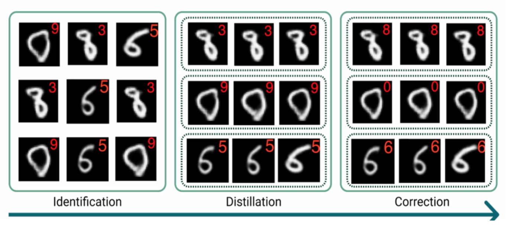

## Training More Robust Models through Creation and Correction of Novel Model Errors

This repository demonstrates how to run and use [Defuse](https://xai4debugging.github.io/files/papers/defuse_training_more_robust_mo.pdf) - a method to train more robust models through creation and correction of novel model errors. Given a trained image classification model (classifier), `Defuse` generates realistically looking images which are incorrectly predicted by the classifier. Further,`Defuse` groups images into high-level model bugs and efficiently corrects them. With `Defuse` users are able to identify scenarios under which their model would fail and subsequently train a more robust model. `Defuse` works in three steps: identification, distillation, and correction.

<p>

</p>

## Security

See [CONTRIBUTING](CONTRIBUTING.md#security-issue-notifications) for more information.

## License

This library is licensed under the [CC BY-NC 4.0](https://creativecommons.org/licenses/by-nc/4.0/) License. See the [LICENSE](LICENSE) file.

## Citation
Please use the following citation when publishing material that uses our code:
```tex
@article{slack2021defuse,
      title={Defuse: Training More Robust Models through Creation and Correction of Novel Model Errors},
      author={Dylan Slack and Nathalie Rauschmayr and Krishnaram Kenthapadi},
      year={2021},
      url={https://xai4debugging.github.io/files/papers/defuse_training_more_robust_mo.pdf},
      journal={XAI4Debugging Workshop @ NeurIPS},

}
```
